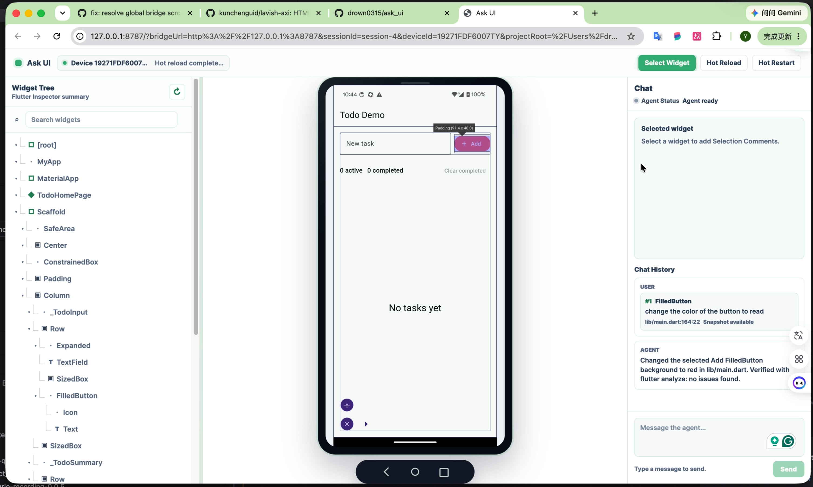

# Ask UI

Ask UI lets you point at a real Flutter screen and send that exact UI context
to a coding agent.

Instead of describing a button, card, or layout problem in words, you open your
app in Ask UI, select the widget on screen, add a comment, and let the agent
work from the selected Flutter UI target.

## Demo

<a href="docs/media/example.mp4">
  
</a>

## What Ask UI Does

- Opens your running Flutter app in a browser-based workbench.
- Lets you select the UI element you want the agent to change.
- Captures comments and selected widget context together.
- Sends that context to Codex, Claude Code, pi, or another coding agent through
  Ask UI Chat.
- Uses `ask_ui_runtime` and `ask_ui_bridge` under the hood to connect the
  workbench to your Flutter app.

## Supported Platforms

Flutter app targets supported by Ask UI:

| Target platform | Android | iOS | Desktop |
| :--- | :---: | :---: | :---: |
| Device | Supported | Coming soon | Not supported |
| Emulator / simulator | Supported | Coming soon | Not supported |

## Quick Start

Install the Ask UI bridge CLI:

```sh
dart pub global activate ask_ui_bridge
```

In the Flutter project you want to inspect, add the runtime package:

```sh
flutter pub add ask_ui_runtime
```

Register the runtime before `runApp`:

```dart
import 'package:ask_ui_runtime/ask_ui_runtime.dart';

void main() {
  registerAskUiRuntime();
  runApp(const MyApp());
}
```

Install the Ask UI agent skill in your coding-agent environment:

```sh
npx skills add https://github.com/drown0315/ask_ui/tree/main/skills
```

Then ask your agent to start Ask UI from the Flutter project. If your app needs
a specific device, flavor, target, or Dart define, tell the agent in that same
request. The skill uses the published `ask_ui_bridge` CLI, starts the Flutter
app, handles device selection when needed, opens the workbench, and keeps
polling for Ask UI Chat messages.

## Requirements

- Dart SDK compatible with `ask_ui_bridge`.
- Flutter project running in debug mode.
- `ask_ui_runtime` registered before `runApp`.
- A supported target from the platform table above. Android targets must be
  available to Flutter and ADB.

## Agent Skill

The published user workflow is in `skills/ask-ui`. It tells the agent how to:

- start Ask UI from a Flutter project,
- handle bridge launch output and device selection,
- run the returned Agent Session Command,
- process Ask UI Chat messages with selected widget context,
- reply back into the Ask UI workbench.

The repository also contains `skills/ask-ui-dev` for Ask UI maintainers working
from this source checkout.
